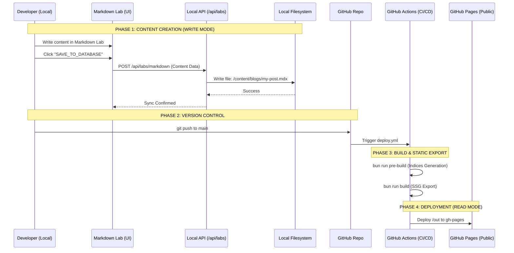
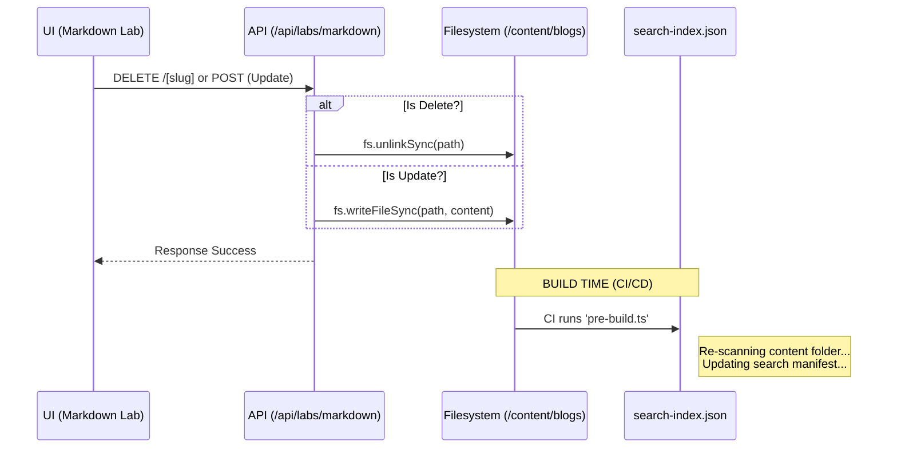
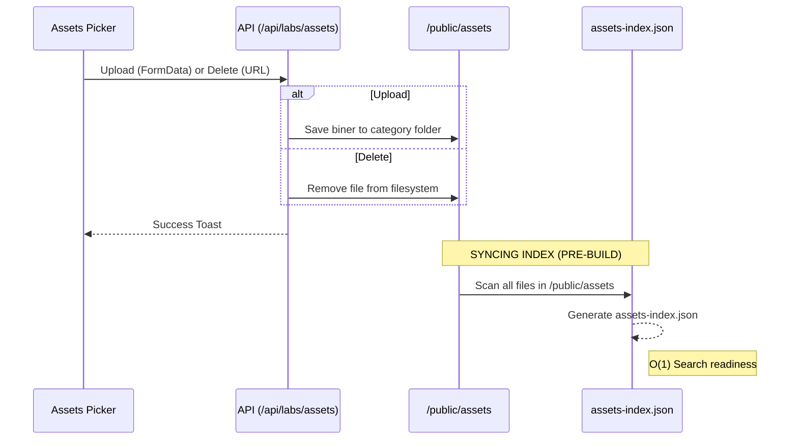

# System Design: Cyberpunk Portfolio & Laboratory

## 1. Architectural Vision
The application is built as a high-performance, statically exported Next.js 16 (React 19) environment. It prioritizes a deep "Cyberpunk 2077" aesthetic while maintaining strict engineering standards through Atomic Design and Headless Logic patterns.

### Key Mandates
- **Atomic Design:** Strict hierarchy; components must reside in `atoms/`, `molecules/`, or `organisms/`.
- **Headless Logic:** 100% of business and data logic must reside in custom hooks.
- **Zero-Logic Render:** Component render functions are purely declarative.
- **Data Integrity:** Professional strings (XTREMAX, GovTech, etc.) must remain literally identical to source data.

---

## 2. Hybrid Operation Mode (SSG vs SSR)

The application employs a dual-mode strategy to function as both a **Public Showcase** and a **Private CMS**.

### 2.1. Write Mode (Dynamic CMS)
- **Context:** Local Development / Docker.
- **Data Flow:** React Query -> Next.js API Routes -> Node.js `fs`.
- **Capability:** Full CRUD. Files are modified directly in the `/content` folder.
- **Persistence:** Direct filesystem persistence.

### 2.2. Read Mode (Static Portfolio)
- **Context:** GitHub Pages / Production.
- **Data Flow:** React Query -> Static JSON Manifests (`public/*.json`).
- **Capability:** Read-Only. Mutation APIs are guarded and return empty/safe states.
- **Indexing Bridge:** A `pre-build.ts` script scans all assets and content during CI/CD to generate the search and asset manifests required for static client-side browsing.

---

## 3. Component Architecture (Atomic Design)

### Atoms (`components/atoms/`)
Smallest, indivisible building blocks. Stateless and visual-only.
- **Button:** Polymorphic button with "Glitch" and "Cyber" variants.
- **AnimatedNumber:** High-intensity roulette effect with system load simulation and terminal "Success" states.
- **Icons:** Standardized `lucide-react` wrappers.
- **Toast:** Neon-themed notifications with state-driven positioning.
- **ScrollReveal/Progress:** Global interaction feedback.
- **Cyber-Primitives:** Components with chamfered edges and glitch effects.

### Molecules (`components/molecules/`)
Functional groups of atoms. Minimal internal UI state.
- **BlogCard:** Themed preview with metadata and hover glitch effects.
- **SearchPalette:** Keyboard-accessible command palette.
- **ExpandableSummary:** Uses `motion/react` for smooth height transitions.
- **SqlEditor:** Monaco-based editor with terminal styling.
- **MermaidDiagram:** Themed rendering with clipboard integration.
- **FileTabs:** Interactive tab management with Portaled context menus.
- **StatusBar:** Responsive dual-line info bar for document stats.
- **AssetsPicker:** Virtualized grid for high-performance asset management (handles 100,000+ items).

### Organisms (`components/organisms/`)
Complex UI sections orchestrating molecules and atoms.
- **Header:** Manages global navigation, Search, and MobileNav with a shared backdrop portal.
- **HomeContent:** Client-side orchestrator for the global "Boot-up" sequence.
- **HeroSection:** High-impact entrance with synchronized theme transitions.
- **SqlTerminalSection:** Interactive laboratory node for browser-side SQL exploration.
- **TranslateLabContent:** Client-side machine translation playground, managing web workers and real-time streaming UI.
- **MarkdownPlaygroundContent:** Layout orchestrator with state-driven view mode transitions and mobile adaptive logic.
- **KnowledgeGraphCanvas:** High-performance 3D visualization using `useFrame` mutations.

---

## 4. Styling & Aesthetic (Cyberpunk 2077)

### Design Tokens
Utilizes Tailwind CSS v4 with custom `@theme` tokens:
- **Colors:** `accent` (Neon Green), `accent-secondary` (Magenta), `accent-tertiary` (Yellow/Orange).
- **Effects:** `.cyber-chamfer` (angled corners), `.cyber-glitch-text` (RGB split animation), `.cyber-grid-bg` (retro-digital background).

### Modular CSS Strategy
To maintain a lean payload and high maintainability, the styling is decoupled into:
- **`app.css`**: Core Tailwind directives, base reset, and global utility classes.
- **`themes.css`**: Centralized theme overrides (`theme-sunset`, `theme-morning`) and dynamic color tokens.
- **`markdown.css`**: Specialized engine for MDX/Technical content rendering (prose, code blocks, alerts).

### Dynamic Theme Orchestration
- **Boot-up Sequence:** The application starts in `theme-sunset` (Orange/Magenta) and transitions to "Operational" (Neon Green) upon reaching 100% load readiness in the `HeroSection`.
- **Background Liberation:** `RootLayout` allows backgrounds to bleed full-width by removing `max-width` constraints from the `main` tag, delegating content centering to individual organisms.

---

## 5. Logic & State Management

### Headless Hooks
Extracted logic layer to ensure UI components remain clean:
- `useIsMobile`: Centralized breakpoint detection.
- `useBlogFilter`: Complex intersection logic for tags and search.
- `useMarkdownEditor` & `useMarkdownActions`: Orchestrates real-time editor speed, VIM mode, and multi-format exports.
- `useTerminal` & `usePgliteActions` / `useDuckDbActions`: Handles system terminal simulation and WASM database operations.
- `useFFmpegCore` & `useFFmpegLabActions`: Manages multithreaded FFmpeg WASM lifecycle, memory-safe file operations (Clean Slate Strategy), and dynamic media processing logic.
- `useTranslationWorker` & `useTranslationParams`: Manages Xenova/transformers.js pipeline lifecycle, Web Worker communication, and URL-synced language state.
- `useMarkdownDocStore`: Manages dual-state content (Active vs Debounced Preview) for zero-lag editing.
- `useAssetsQuery`: Adaptive hook that switches endpoints based on `APP_MODE`.

### Data Flow
- **Server-Side:** Pages (`app/**/page.tsx`) fetch MDX data and prepare SEO/JSON-LD.
- **Client-Side:** Data is injected into Organisms. Heavy computation (SQL/Analytics/Transcoding/Machine Translation) is performed in WASM-based local nodes (PGlite, DuckDB, FFmpeg-MT, ONNX Runtime).

---

## 6. UI Stability & Performance

### 6.1. Portals & Overlays
- **Parent Prop Method:** Centralized backdrop control in `Header.tsx` ensures reliable click-outside detection for mobile navigation.
- **React Portals:** Used for floating context menus (e.g., Markdown Lab) and modals to prevent overflow clipping by parent containers and maintain consistent z-index layering.

### 6.2. Performance & Memory Management
- **0% Logic in Render:** Prevents expensive calculations during UI updates.
- **SSG-Safe Animations:** `AnimatedNumber` and `PageTransition` use hydration checks to prevent mismatch errors.
- **DRY Breakpoints:** No redundant resize observers; all mobile logic uses a single source of truth.
- **WASM Clean Slate Strategy:** Input files are deleted from virtual memory immediately after FFmpeg execution, before output reading, to prevent Out-Of-Memory (OOM) crashes during heavy transcoding.
- **Dynamic Multithreading:** FFmpeg node dynamically scales worker threads based on `navigator.hardwareConcurrency` to maximize processing speed without starving the main thread. Cross-Origin Isolation is maintained via a local `coi-serviceworker`.
- **Grid Virtualization:** The `AssetsPicker` uses `useVirtualizer` to handle 100,000+ items without DOM bloat. It renders only the visible rows, ensuring O(1) rendering performance regardless of database size.

### 6.3. Motion & Transitions
Transitions between laboratory view modes and file interactions use `motion/react` with `AnimatePresence` to ensure a smooth, "living" interface feel.

---

## 7. Deployment & CI/CD
The project uses GitHub Actions to automate the transition from Write to Read mode:
1. **Pre-build:** Generates static indices and asset manifests.
2. **Build:** Exports static HTML and compiles React components.
3. **Deploy:** Pushes to GitHub Pages with `coi-serviceworker` to enable multithreaded WASM.

---

## 8. Operational Workflows

### 8.1. Content Lifecycle: Write to Read Mode

### 8.2. Content Update & Delete Workflow

### 8.3. Asset Management Workflow

