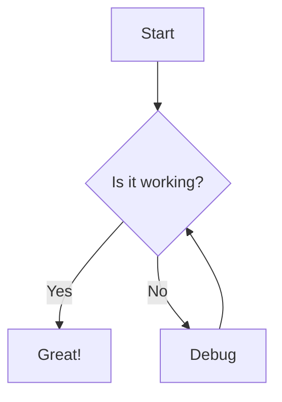
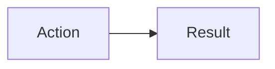

## LaTeX Rendering

Inline math: $E = mc^2$

Block math:

$$
\int_{a}^{b} x^2 dx = \frac{b^3 - a^3}{3}
$$

## Mermaid Diagram



```typescript
const hello = "world";
console.log(hello);
```

## Emoji Support

Rocket: :rocket:
Smile: :smile:
Check: :white_check_mark:

## Table Support

| Header 1 | Header 2 |
| -------- | -------- |
| Cell 1   | Cell 2   |

## Technical Content

Here is a diagram:



And some code:

```typescript
function test() {
  console.log("working");
}
```

| Component | Status |
| --------- | ------ |
| Copy      | Fixed  |
| Export    | New UI |
| Share     | New UI |
| Mermaid   | Zoomed |
